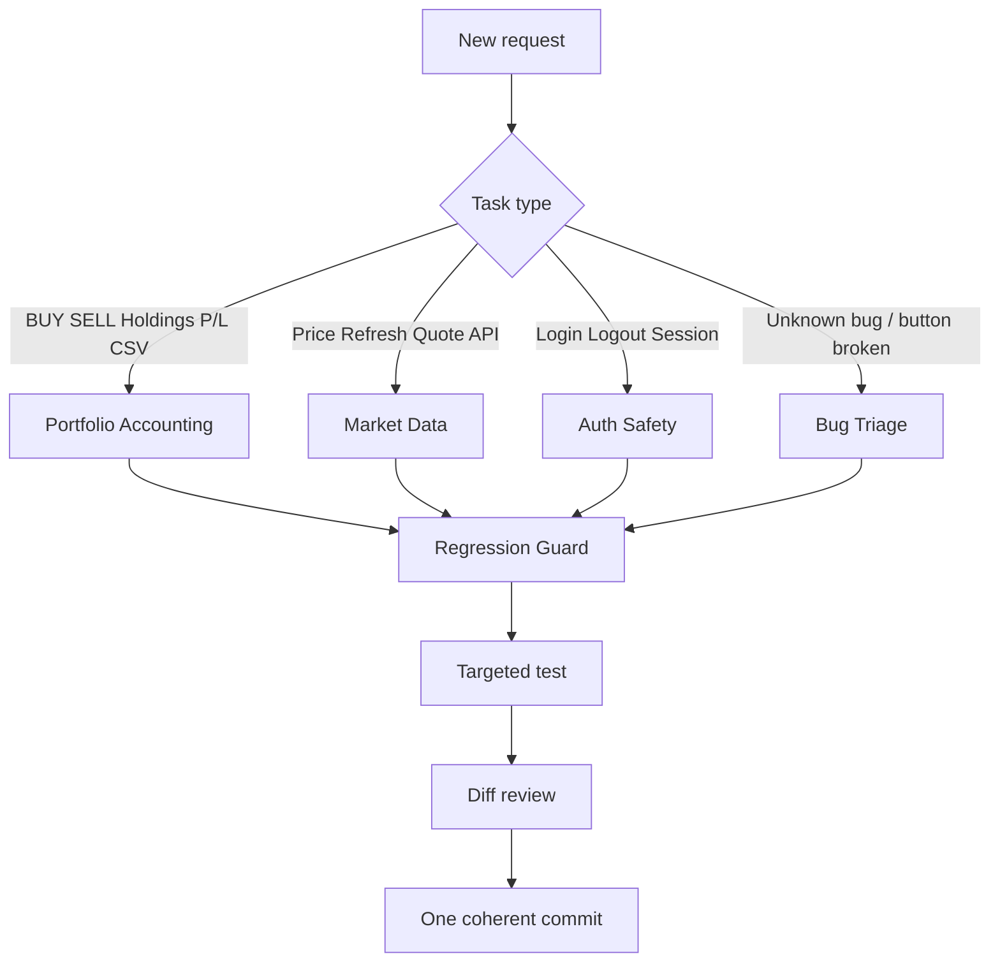
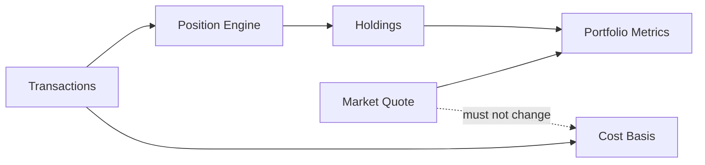

# Stock-Analysis Workflow Note

## Which skill should run?

## Portfolio data flow

## Short operating note
For UI-only work, stay in UI unless evidence points elsewhere. For accounting changes, protect transaction invariants first. For market refresh problems, preserve the last valid quote instead of turning portfolio value into zero. For auth changes, always verify refresh + logout + mobile/back-navigation behavior.
